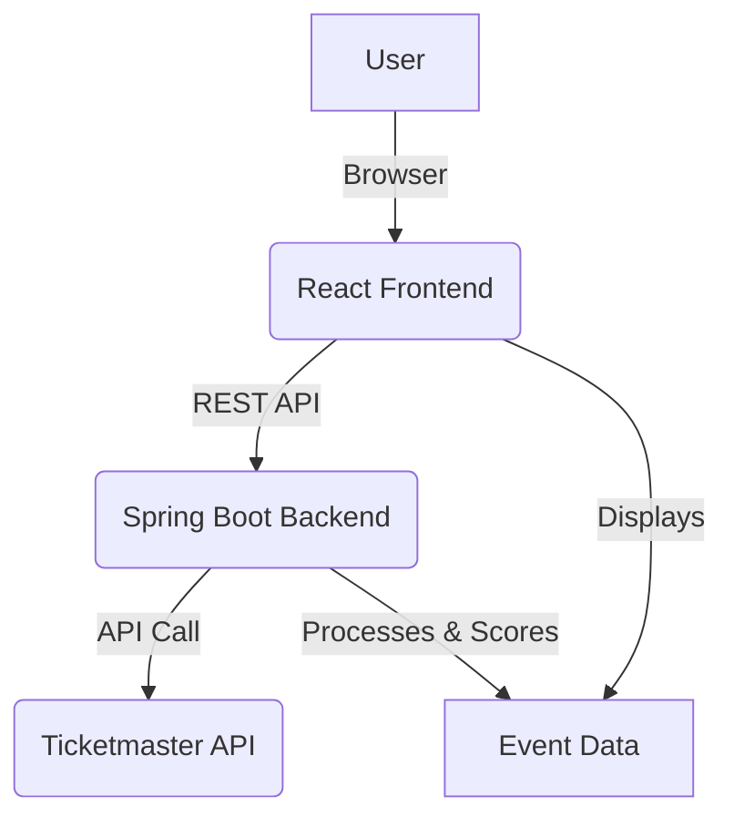

# Nashville Event Pulse 🎵

A modern, full-stack event management system for Nashville's vibrant entertainment scene. This application provides real-time event tracking, venue management, and impact analysis for hotels and businesses in the Nashville area.

---

## Table of Contents
1. [Project Overview](#project-overview)
2. [Features](#features)
3. [Tech Stack](#tech-stack)
4. [Architecture](#architecture)
5. [Setup & Installation](#setup--installation)
6. [Configuration](#configuration)
7. [File Structure](#file-structure)
8. [API Reference](#api-reference)
9. [UI Components](#ui-components)
10. [Deployment](#deployment)
11. [Contribution Guidelines](#contribution-guidelines)
12. [Support & Contact](#support--contact)

---

## Project Overview

Nashville Event Pulse is a full-stack web application that aggregates, analyzes, and visualizes event data for the Nashville area. It is designed for hotels, venues, and businesses to monitor real-time event impact, manage venues, and optimize guest experiences. The system fetches live event data from the Ticketmaster API, processes and scores events, and presents them in a beautiful, interactive dashboard.

---

## Features

### Frontend (React + Vite)
- **Modern UI/UX**: Responsive design with Tailwind CSS and Shadcn UI
- **Real-time Dashboard**: Live event statistics and impact metrics
- **Event Management**: Comprehensive event listing with advanced filtering
- **Venue Analytics**: Detailed venue information and capacity tracking
- **Integration Hub**: External API connections and system monitoring
- **Settings Management**: Configurable hotel and system preferences
- **Image Optimization**: Quality-based image selection and fallback

### Backend (Spring Boot)
- **RESTful API**: Complete REST API for frontend communication
- **Ticketmaster Integration**: Real-time event data from Ticketmaster API
- **Image Processing**: Intelligent image selection and optimization
- **Impact Scoring**: Calculates event impact based on venue, category, date, and price
- **Venue Metadata**: Enriches events with venue tier/type
- **Multi-page Fetching**: Aggregates data from multiple API calls
- **CORS Support**: Cross-origin resource sharing enabled
- **Configurable**: API keys, base URL, and port via properties file

---

## Tech Stack

### Frontend
- **React 18** (hooks, functional components)
- **Vite** (fast build tool)
- **Tailwind CSS** (utility-first CSS)
- **Shadcn UI** (component library)
- **Lucide React** (icon library)
- **React Router** (routing)
- **Date-fns** (date utilities)

### Backend
- **Spring Boot 3** (Java microservices)
- **Maven** (build automation)
- **RestTemplate** (HTTP client)
- **Jackson** (JSON processing)
- **SLF4J** (logging)

---

## Architecture

### High-Level Flow



- **Frontend**: React app (Vite) fetches event/venue/config data from backend, renders dashboards, analytics, and management UIs.
- **Backend**: Spring Boot app fetches and processes data from Ticketmaster, enriches with venue metadata, scores impact, and exposes REST endpoints.
- **Image Processing**: Backend selects optimal images for events, provides metadata and fallbacks.

---

## Setup & Installation

### Prerequisites
- Node.js 18+ 
- Java 17+
- Maven 3.6+

### Frontend Setup
```bash
npm install
npm run dev # Start development server
npm run build # Build for production
```

### Backend Setup
```bash
cd eventsystem
mvn clean install
mvn spring-boot:run
```

---

## Configuration

### Frontend
- Connects to backend API at `http://localhost:8080` by default.

### Backend
Edit `eventsystem/src/main/resources/application.properties`:
```properties
# Server configuration
server.port=8080

# Ticketmaster API configuration
api.ticketmaster.key=YOUR_API_KEY
api.ticketmaster.base-url=https://app.ticketmaster.com/discovery/v2/events.json

# CORS configuration
spring.web.cors.allowed-origins=http://localhost:5173
```

---

## File Structure

```
root/
├── src/                # Frontend source
│   ├── api/            # API integration helpers
│   ├── components/     # UI components (dashboard, events, venues, etc.)
│   ├── hooks/          # Custom React hooks
│   ├── lib/            # Utility libraries
│   ├── pages/          # Page-level components (Dashboard, Events, Venues, etc.)
│   ├── utils/          # Utility functions
│   ├── App.jsx         # Main app component
│   ├── main.jsx        # Entry point
│   └── index.css       # Tailwind and global styles
├── eventsystem/        # Backend (Spring Boot)
│   ├── pom.xml         # Maven config
│   ├── src/main/java/com/example/eventsystem/
│   │   ├── EventsystemApplication.java   # Main entry
│   │   ├── controller/EventController.java # REST API
│   │   ├── service/TicketmasterService.java # Ticketmaster logic
│   │   ├── service/ImageProcessingService.java # Image logic
│   │   └── model/EventResponse.java      # Event data model
│   └── src/main/resources/application.properties # Config
├── package.json        # Frontend dependencies
├── README.md           # This file
└── ...
```

---

## API Reference

### Events
- `GET /api/events` — List events (supports filtering, pagination, sorting)
  - Query params: `startDate`, `endDate`, `keyword`, `page`, `size`, `sortBy`, `sortDir`, `lat`, `lon`, `radius`, `period`
- `GET /api/venues` — List venues
- `GET /api/config` — Get system config
- `POST /api/config` — Update system config

#### Example
```bash
curl "http://localhost:8080/api/events?keyword=music&startDate=2025-08-01T00:00:00Z&endDate=2025-08-31T23:59:59Z"
```

#### Response
Returns a JSON array of event objects, each with:
- `id`, `name`, `date`, `time`, `venue`, `address`, `category`, `price`, `ticketUrl`, `status`, `description`, `venueTier`, `venueType`, `impactScore`, `impactLevel`, `distance`, `eventImage`, `imageMetadata`, etc.

---

## UI Components

### Dashboard
- Real-time event statistics
- Impact score tracking
- Quick action buttons
- Activity feed

### Events
- Advanced filtering (date, impact level, venue type)
- Grid and list view
- Event cards with images, badges, and metadata
- Pagination

### Analytics
- Event impact timeline
- Venue utilization charts
- Category distribution
- Interactive charts

### Integration
- API connection status
- System health monitoring
- External service management

---

## Deployment

### Frontend
```bash
npm run build
# Deploy dist/ to Netlify, Vercel, AWS S3, etc.
```

### Backend
```bash
cd eventsystem
mvn clean package
java -jar target/eventsystem-0.0.1-SNAPSHOT.jar
```

---

## Contribution Guidelines

1. Fork and clone the repository
2. Create a new branch for your feature or fix
3. Follow the existing code style (Java 17+, Spring Boot, React)
4. Add/modify classes in the appropriate package
5. Test your changes locally
6. Submit a pull request with a clear description

---

## Support & Contact

For support, questions, or feature requests:
- Create an issue in this repository
- Contact: harshit@nashvilledigitalgroup.com

---

**Built with ❤️ for Nashville's vibrant entertainment scene**